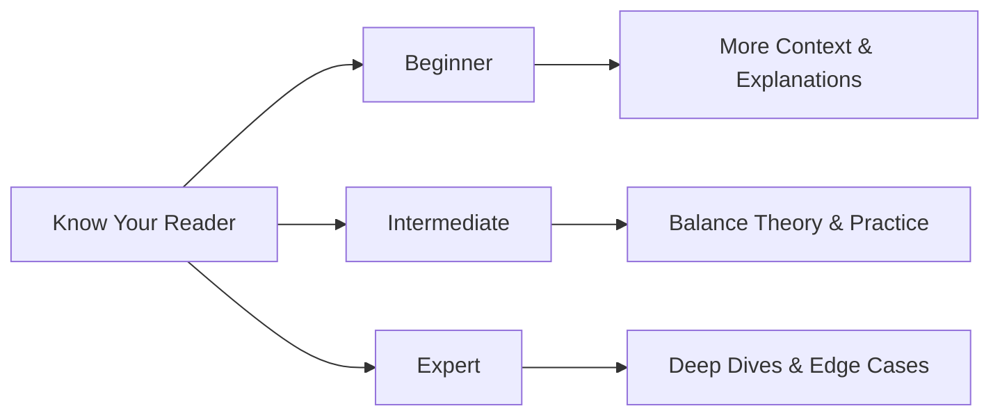
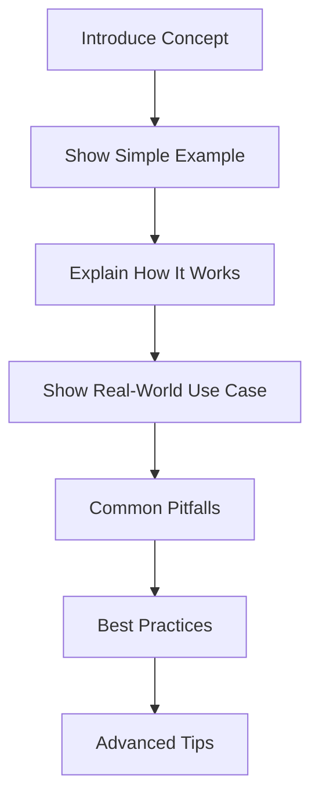
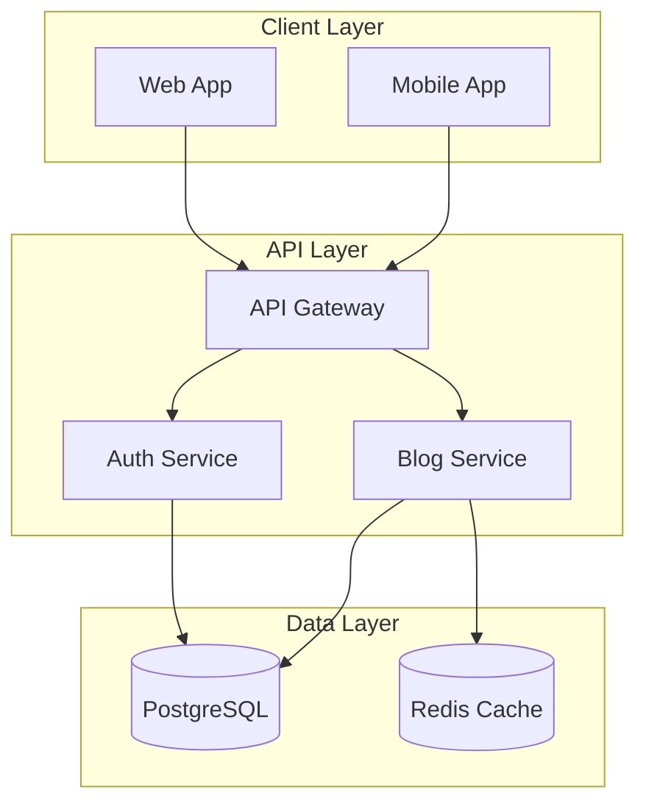

# Writing Effective Technical Blog Posts: A Practical Guide

Writing technical content can be challenging. You want to share your knowledge, help others solve problems, and establish yourself as an expert—but where do you start? After years of writing and reading technical blogs, I've learned that great posts aren't just about having deep technical knowledge. They're about communication, structure, and empathy for your readers.

<!-- more -->

In this guide, I'll walk you through the essential elements of writing compelling technical blog posts that resonate with developers and actually get read.

## Understanding Your Audience

Before typing a single word, ask yourself: **Who is this for?**



!!! tip "Pro Tip: The Curse of Knowledge"
    We often forget what it's like to NOT know something. When writing, imagine explaining the concept to yourself from six months ago. What would past-you need to know?

Your audience determines:

- **Technical depth**: How much you can assume they know
- **Language complexity**: Whether to use jargon or explain every term
- **Code examples**: Starter templates vs. production-ready snippets
- **Prerequisites**: What they need before reading

## The Anatomy of a Great Blog Post

Let's break down the structure that works consistently well:

### 1. The Hook (First 3 Sentences)

Your opening determines whether readers continue or bounce. Use one of these patterns:

=== "The Problem Hook"

    ```markdown
    Have you ever deployed to production only to watch your app
    crash because of a timezone bug? I have—and it taught me
    everything I know about temporal data handling.
    ```

=== "The Surprise Hook"

    ```markdown
    Most developers think async/await makes JavaScript easy.
    They're wrong. Here's why the Promise constructor is more
    powerful than you think.
    ```

=== "The Stats Hook"

    ```markdown
    78% of mobile apps are uninstalled after a single use.
    The culprit? Poor onboarding UX. Let's fix that.
    ```

!!! warning "Avoid These Opening Mistakes"
    - ❌ "In this blog post, I will explain..."
    - ❌ Starting with excessive background/history
    - ❌ Apologizing for your knowledge level
    - ✅ Jump straight into the value proposition

### 2. The Setup (Context Without Fluff)

Give readers just enough context to understand why this matters:

```python
# ❌ Too much context
"""
HTTP was invented in 1991 by Tim Berners-Lee at CERN.
It stands for HyperText Transfer Protocol and uses
a client-server model with request-response pairs...
"""

# ✅ Right amount of context
"""
When building REST APIs, choosing the right HTTP status code
matters. Here's how to use 200, 201, 204, and 304 correctly.
"""
```

### 3. The Core Content (Structured Learning)

Here's the ideal flow for technical content:



#### Code Examples That Teach

**Bad code example:**
```javascript
// Don't do this
const x = data.map(y => y.z).filter(z => z);
```

**Good code example:**
```javascript
// Extract active user emails from API response
const activeUserEmails = userData
  .filter(user => user.isActive) // (1)!
  .map(user => user.email)       // (2)!
  .filter(email => email);       // (3)!
```

1. First, filter to only active users
2. Then extract just the email field
3. Finally, remove any null/undefined emails

!!! info "Code Annotation Best Practice"
    Use numbered annotations `(1)!` to explain complex logic inline without cluttering the code. Readers can follow the flow naturally.

### 4. Visual Elements

Technical posts aren't just walls of text. Use visuals strategically:

#### When to Use Diagrams

| Diagram Type | Best For | Tool |
|-------------|----------|------|
| Flowcharts | Process flows, algorithms | Mermaid |
| Sequence | API interactions, async flows | Mermaid |
| Architecture | System design, components | Mermaid/Excalidraw |
| Screenshots | UI walkthroughs, debugging | Annotated images |

Example architecture diagram:



### 5. Admonitions for Emphasis

Use callout boxes to highlight important information:

!!! success "When Something Works Well"
    This Firebase feature reduced our cold start time by 40%.
    Highly recommend implementing it if you're using Cloud Functions.

!!! danger "Critical Warnings"
    Never store API keys in client-side code. This includes
    React .env files that get bundled—they're still public!

!!! example "Practical Examples"
    Here's how we implemented this pattern in production at scale:

    ```kotlin
    class UserRepository @Inject constructor(
        private val api: ApiService,
        private val cache: UserCache
    ) {
        suspend fun getUser(id: String): Result<User> =
            cache.get(id) ?: api.fetchUser(id).also { cache.put(it) }
    }
    ```

!!! question "Common Questions"
    **Q: Should I use REST or GraphQL?**
    A: It depends on your use case. REST for simple CRUD, GraphQL when
    clients need flexible data fetching.

## Front Matter: The Metadata That Matters

Every blog post should start with proper front matter:

```yaml
---
date: 2026-01-24                    # Publication date (required)
authors:                            # One or more authors
  - gde_team
  - john_doe
categories:                         # Primary category (max 2-3)
  - Android
  - Firebase
tags:                               # Specific topics (5-8 tags)
  - jetpack-compose
  - authentication
  - best-practices
  - kotlin
draft: false                        # Set to true for unpublished posts
slug: jetpack-compose-auth-guide    # Optional: custom URL slug
---
```

!!! tip "Category vs Tags"
    - **Categories**: Broad topics (Android, Cloud, Web)
    - **Tags**: Specific subjects (jetpack-compose, firebase-auth, kotlin-coroutines)

## Writing Tips for Developers

### Use Active Voice

| Passive (Weak) | Active (Strong) |
|----------------|-----------------|
| The function was called by the event handler | The event handler calls the function |
| Errors can be caught using try-catch | Use try-catch to catch errors |
| Memory leaks are caused by... | This pattern causes memory leaks |

### Keep Paragraphs Short

On screens, dense text is hard to read. Aim for:

- **2-4 sentences per paragraph** for body text
- **1 sentence for emphasis** when introducing key concepts
- **Lists for multiple points** instead of comma-separated items

### Technical Terms

First mention: **explain it**

```markdown
We'll use a **closure** (a function that captures variables from
its surrounding scope) to maintain state between calls.
```

Subsequent mentions: **use it naturally**

```markdown
The closure now has access to the counter variable...
```

## Common Pitfalls to Avoid

### ❌ The Tutorial That Doesn't Work

!!! danger "Test Your Code!"
    Copy-paste your code examples into a fresh environment and run them.
    Nothing destroys credibility faster than code that doesn't work.

### ❌ Assuming Too Much Knowledge

```javascript
// ❌ Assumes reader knows async/await, fetch API, and error handling
const data = await fetch('/api').then(r => r.json());

// ✅ Shows the complete pattern
async function fetchUserData() {
  try {
    const response = await fetch('/api/users');
    if (!response.ok) throw new Error('Failed to fetch');
    return await response.json();
  } catch (error) {
    console.error('Error fetching users:', error);
    return null;
  }
}
```

### ❌ No Clear Takeaway

Every post should end with actionable next steps:

```markdown
## What You've Learned

✅ How to structure technical blog posts
✅ When to use diagrams vs. code examples
✅ Front matter configuration for MkDocs
✅ Writing accessible technical content

## Next Steps

1. [Download the blog post template](#)
2. [Check out our style guide](#)
3. [Submit your first post](#)
```

## Tools & Resources

Here are some tools that make blogging easier:

| Tool | Purpose | Link |
|------|---------|------|
| Material for MkDocs | Static site generator | [squidfunk.github.io](https://squidfunk.github.io/mkdocs-material/) |
| Mermaid | Diagrams as code | [mermaid.js.org](https://mermaid.js.org/) |
| Carbon | Beautiful code screenshots | [carbon.now.sh](https://carbon.now.sh/) |
| Hemingway Editor | Readability checker | [hemingwayapp.com](https://hemingwayapp.com/) |

!!! info "Keyboard Shortcuts"
    When documenting UI interactions, use keyboard notation:

    - ++ctrl+c++ to copy
    - ++cmd+shift+p++ for command palette
    - ++alt+enter++ to show quick fixes

## Conclusion

Writing effective technical content is a skill that improves with practice. The best posts combine:

1. **Clear structure** that guides readers
2. **Code examples** that actually work
3. **Visuals** that clarify complex concepts
4. **Empathy** for readers at different skill levels

Remember: you don't need to know everything to write valuable content. You just need to know *one thing* that helped you, and share it clearly with others who might face the same challenge.

Now it's your turn. What will you write about?

---

*Have questions or suggestions for improving this guide? Open an issue or submit a PR to our [GitHub repository](https://github.com/gde-americas/gde-americas-hub).*
